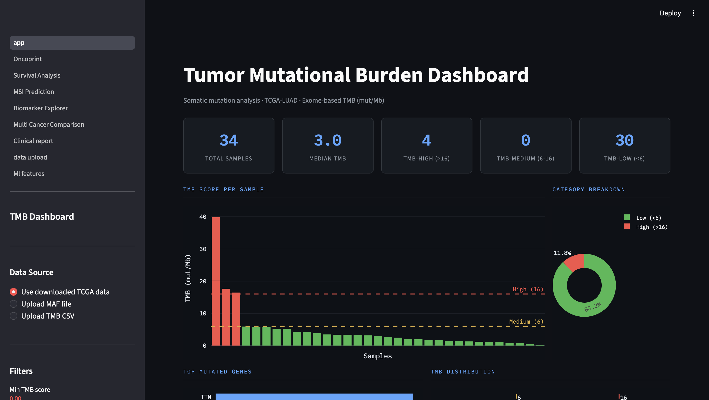
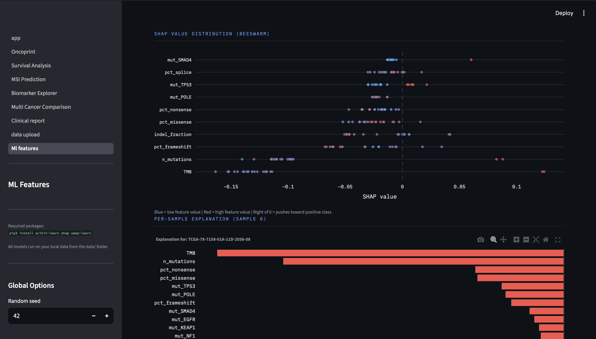
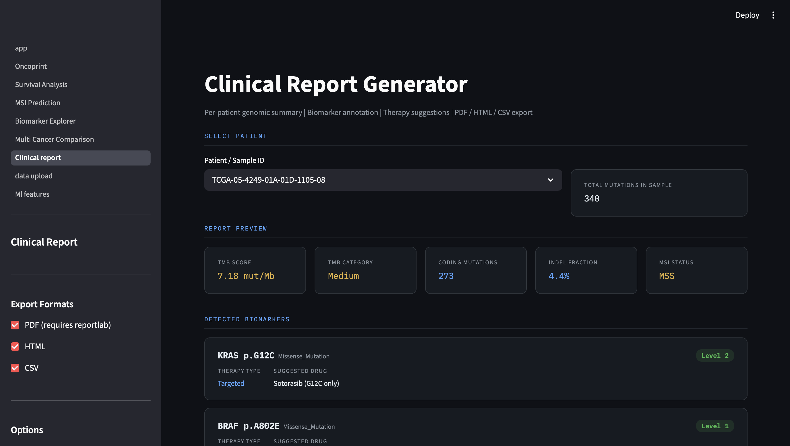

# Precision Oncology Analytics Platform

Interactive multi-module platform for cancer genomics analysis, immunotherapy biomarker discovery, clinical reporting, and machine learning-driven precision oncology research.

---

# Features

- Tumor Mutational Burden (TMB) analysis
- MSI prediction
- Immunotherapy response prediction
- Mutation clustering
- Molecular subtype classification
- Explainable AI with SHAP
- Neoantigen prediction
- Multi-omics integration
- Clinical genomic report generation
- Oncoprints and survival analysis

---

# Repository Structure

```text
precision-oncology-platform/
│
├── app.py
├── requirements.txt
├── README.md
├── LICENSE
├── .gitignore
│
├── pages/
│   ├── oncoprint.py
│   ├── survival_analysis.py
│   ├── msi_prediction.py
│   ├── biomarker_explorer.py
│   ├── multi_cancer_comparison.py
│   ├── clinical_report.py
│   ├── data_upload.py
│   └── ml_features.py
│
├── data/
│   └── sample_data/
│
├── assets/
│   └── screenshots/
│
└── docs/
    └── methodology.md
```

---

# Installation

## Clone Repository

```bash
git clone https://github.com/shwaschuri/precision-oncology-platform.git

cd precision-oncology-platform
```

---

## Install Dependencies

```bash
pip install -r requirements.txt
```

---

# Run Application

```bash
streamlit run app.py
```

---

# Required Packages

- streamlit
- pandas
- numpy
- plotly
- scikit-learn
- shap
- umap-learn
- lifelines
- reportlab
- matplotlib
- seaborn

---

# Input Data

The platform expects mutation datasets in MAF-like CSV format.

Supported columns:

- Hugo_Symbol
- Tumor_Sample_Barcode
- Variant_Classification
- HGVSp_Short
- Chromosome
- Start_Position
- t_depth
- t_alt_count

---

# Modules

## Oncoprint
Mutation landscape visualization.

## Survival Analysis
Kaplan-Meier survival analysis and biomarker stratification.

## MSI Prediction
Computational MSI-H / dMMR estimation.

## Biomarker Explorer
Interactive actionable biomarker analysis.

## Multi-Cancer Comparison
Cross-cancer mutation analysis.

## Clinical Report Generator
Per-patient genomic reports with therapy suggestions.

## Machine Learning Features

- Immunotherapy response prediction
- Tumor subtype classification
- SHAP explainability
- Mutation clustering
- Neoantigen prediction
- Multi-omics integration

---

# Screenshots


```markdown





```

---

# Disclaimer

This project is intended for research and educational purposes only.

It is NOT intended for clinical diagnosis or treatment decisions.

All findings should be validated by qualified healthcare professionals.

---

# Author

Shwas Churi

MSc Bioinformatics  
University of Glasgow

Interests:
- Cancer Genomics
- Precision Oncology
- Machine Learning
- Computational Biology

---

# License

MIT License
